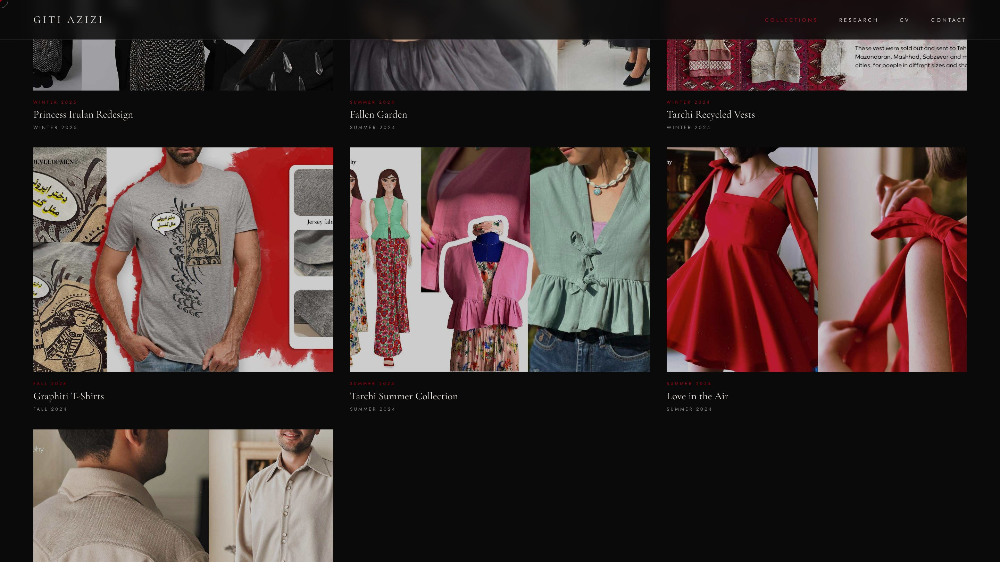
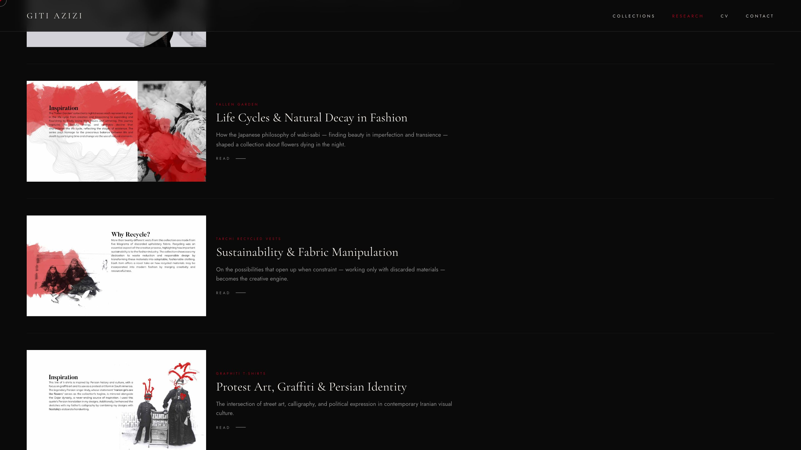
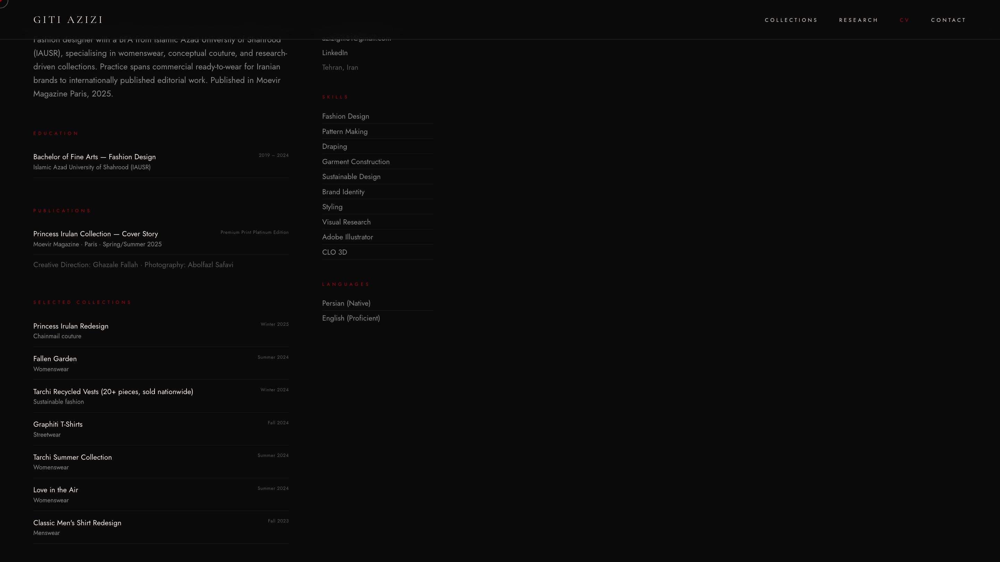
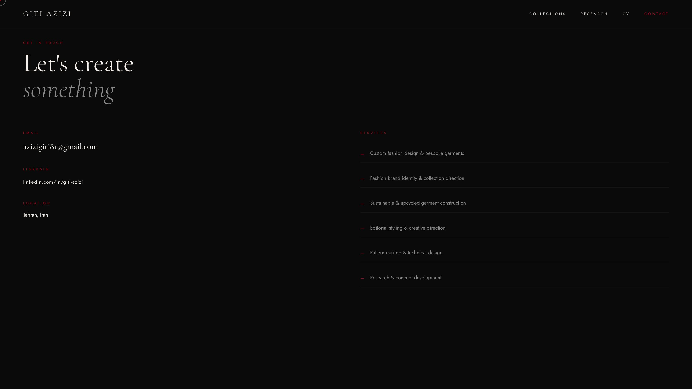

# Giti Azizi Portfolio

A modern fashion portfolio website for **Giti Azizi** with a cinematic visual style, dynamic content management, and a password-protected admin panel.

## Live Demo

- Production: [https://giti-final.vercel.app](https://giti-final.vercel.app)

## Project Highlights

- Editorial-style landing experience with motion and custom typography
- Dynamic **Collections** and **Research** content
- Admin dashboard for creating, editing, publishing, and deleting entries
- Seed endpoint for restoring base portfolio content
- Responsive layout for desktop and mobile

## Tech Stack

- **Framework:** Next.js 14 (App Router)
- **Language:** TypeScript
- **UI:** React 18 + Tailwind CSS
- **Database:** MongoDB Atlas + Mongoose
- **Authentication:** NextAuth (Credentials)
- **Deployment:** Vercel

## Screenshots

### Home


### Collections



### Research



### CV



### Contact



## Main Routes

- `/` — Home
- `/collections` — All collections
- `/collections/[slug]` — Collection detail
- `/research` — All research entries
- `/research/[slug]` — Research detail
- `/cv` — CV page
- `/contact` — Contact page
- `/admin-auth` — Admin login
- `/admin` — Admin dashboard

## Admin Features

- Manage Collections:
  - title, slug, season/year, description/story
  - images, materials, palette, featured/published flags
- Manage Research:
  - title, slug, related collection, description/content, images, published flag
- Settings:
  - one-click database seed

## Local Development

```bash
npm install
npm run dev
```

